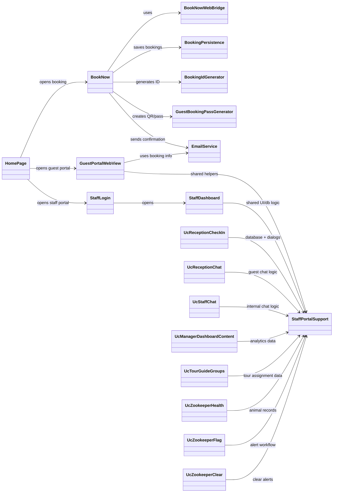

# WildNest Simplified Class Diagram

Use this Mermaid source to generate or redraw a clean class diagram for printing.

Recommended print approach:
- `A3`, `Landscape`
- keep this as the **simplified class diagram** for defense
- do not print the giant auto-generated class map unless your professor explicitly wants every field and method

