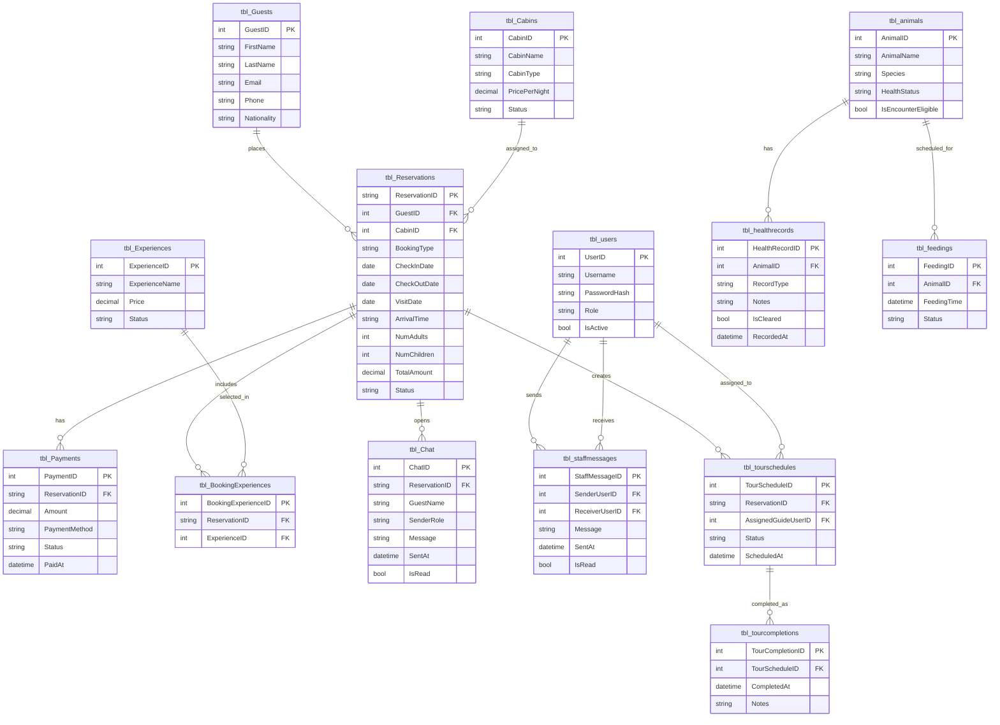

# WildNest Simplified ERD

Use this Mermaid source to generate or redraw a clean ERD for printing.

Recommended print approach:
- `A3`, `Landscape`
- this is the **best hard-copy size** if your professor wants it readable
- if you only have normal bond paper, use `Legal` landscape for ERD and `A3` for class diagram

